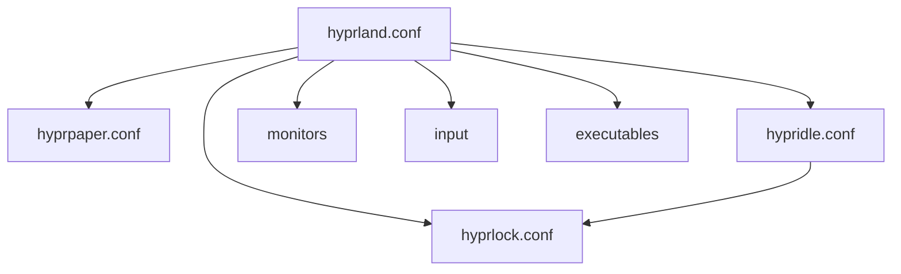

# 🌌 Hyprland Configuration Knowledge Base

## 🗺️ System Map (Relationships)

## 📂 File Overview

| File | Role | Description |
| --- | --- | --- |
| [hyprland.conf](./hyprland.conf.md) | 🛰️ Core | The main orchestrator of the session. |
| [hyprpaper.conf](./hyprparser.conf.md) | 🖼️ Wallpaper | Manages background images. |
| [hypridle.conf](./hypridle.conf.md) | 💤 Idle Management | Handles inactivity timeouts. |
| [hyprlock.conf](./hyprlock.conf.md) | 🔒 Lockscreen | Manual/automatic screen locking UI. |

---
*Generated by Hermes Agent*
